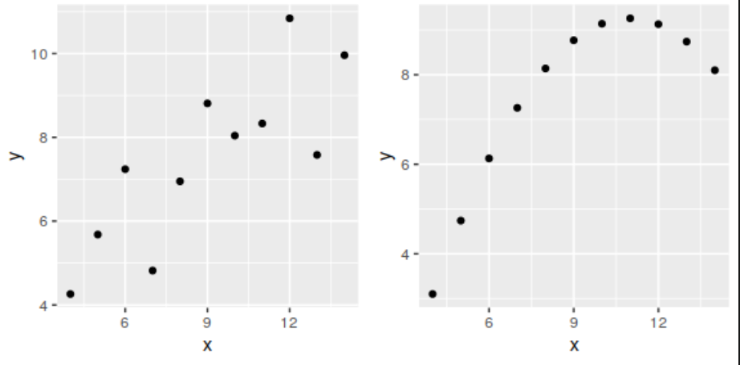

# 相关性

## 皮尔森相关系数

$$
r= \frac{Cov(x,y)}{\sigma(x)\sigma(y)} =\frac{\sum\left(x_{t}-\bar{x}\right)\left(y_{t}-\bar{y}\right)}{\sqrt{\sum\left(x_{t}-\bar{x}\right)^{2}} \sqrt{\sum\left(y_{t}-\bar{y}\right)^{2}}} 
$$

!!! tip "注意"
     1. $r \in [-1, 1]$ 。
     2. 只能衡量==线性关系== 的相关程度。
     3. $r_{x_1,y_1} = r_{x_2,y_2}$ 但 $(x_1,y_1)$ 与 $(x_1,y_2)$ 可能拥有不同的形态; 因此在分析变量之间关系时，不仅要看相关系数值，而且要关注生成的图形。
     4. 
??? info classes "例子"
    === "相同系数不同形态"
        {width=50%}
    === "只能衡量线性关系"
        todo

## 自相关

给定一个时间序列数据 $\{r_t\}_{t=1}^T$ , $\bar r$ 为均值， 则间隔为1（$l=1$）的自相关系数为

$$
\hat{\rho}_{1}=\frac{\sum_{t=2}^{T}\left(r_{t}-\bar{r}\right)\left(r_{t-1}-\bar{r}\right)}{\sum_{t=1}^{T}\left(r_{t}-\bar{r}\right)^{2}}
$$

:point_right: $\hat{\rho_1}$ 是 $\rho_1$ 的 ==相合估计==。 且如果 $\{r_t\}$ 满足独立同分布、$E(r_t^2) < \infty$ 则

1. $\hat{\rho_1}$ 渐进服从均值为0，方差为 $1/T$ 的正态分布。
2. 

