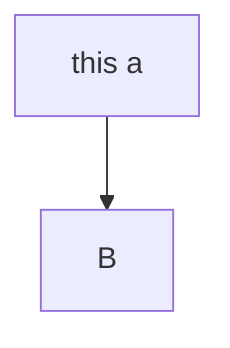

$u$: 用户, 全集为： $\mathcal{U}$

$i_t$ :  $t$ 时刻推荐的商品,  推荐全集为： $\mathcal{I}$

$f_t$ :  $t$ 时刻用户给的反馈(用户点击、购买、离开等行为）， 反馈全集为： $\mathcal{F}$

---

State设计：
$$
S_t= \{\overbrace{u}^{\texttt{user information}}, (i_1, f_1, d_1),\dots ,\overbrace{(i_t, f_t, d_t)}^{\texttt{user feedback on item in time d}} \}
$$

1. 开始，状态特征只包含用户信息

 	2. 其后，每一个时间点，追加时间点给用户推荐的商品以及用户停留时间和反馈。

---

Reward设计：
$$
r_{t}=\overbrace{\omega^{\top}}^{\texttt{weight vector}} \overbrace{\boldsymbol{m}_{t}}^{\texttt{metirces}}
$$
其中：

​	$m_t$ 表示为：  $[m_t^c, m_t^d , m_t^r]$

1. Instant metircs: 

   1. 在第 $t$ 次反馈点击的次数： $m_t^{c} =  \#clicks(f_t)$

2. Delayed metirces:

   1. 在第 $t$ 次浏览深度： $m_{t}^{d}=\# \operatorname{scans}\left(f_{t}\right)$

   2. 回归时间： $m_t^r = \frac{\beta}{v_r}$

      其中： $v_r$ 表示两次浏览的间隔时长

---

Value 函数设计：
$$
Q^{\pi}\left(s_{t}, i_{t}\right)=\mathbb{E}_{i_{k} \sim \pi }  \left[\underbrace{r_{t}}_{\texttt {current rewards }}+\underbrace{\sum_{k=1}^{T-t} \gamma^{k} r_{t+k}}_{\texttt {future rewards }}\right]
$$

​			
