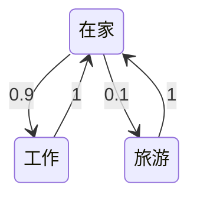

### 马尔科夫性

$$
\mathbb{P}\left[S_{t+1} | S_{t}\right]=\mathbb{P}\left[S_{t+1} | S_{1}, S_{2}, \ldots, S_{t}\right]
$$

- **未来** 只取决于 **现在**

---

### 状态转移矩阵

$$
\mathcal{P}=\texttt{<from states>} \overbrace{\left[\begin{array}{ccc}
\mathcal{P}_{11} & \cdots & \mathcal{P}_{1 n} \\
\vdots & \ddots & \vdots \\
\mathcal{P}_{n 1} & \cdots & \mathcal{P}_{n n}
\end{array}\right]}^{\texttt{<to states>}}
$$

- 

---

### 片段（episode）

从初始状态到终止状态的序列过程，称为一个片段：
$$
S_1, S_2, ... , S_T
$$

- 如果有 **终止状态** 称为： *片段任务*

- 否则没有 **终止状态** 称为： *连续性任务*

---

### 马尔科夫过程（MP）

$$
< \mathcal S, \mathcal P >
$$

- $\mathcal S$ : 状态集合

- $\mathcal P$ : [状态转移矩阵](#状态转移矩阵)

  

如： <在家、工作、在家、旅游> 状态序列为一个过程序列，也称为==马尔科夫链==。

- 无记忆，随机过程
- 通常并不知道 $\mathcal P$ 具体的值，但通常假设它存在且稳定。

---

### 马尔科夫奖励过程

马尔科夫奖励过程是带 *值* 的马尔科夫链：
$$
<\mathcal S, \mathcal P, \mathcal R, \gamma>
$$
$\gamma$ 是衰减系数，表达了对未来利益的取舍程度。

$G_t$ 是序列从 $t$ 时刻开始的回报（Return）。按照 $\gamma$ 进行衰减：
$$
G_t= R_{t+1}+ \gamma R_{t+2} + ... + \gamma^k R_{t+k+1}
$$
​	奖励 $R$ 是针对状态的，而回报 $G$ 是针对片段的。

---

### 衰减

- 避免无穷大的Return
- 距离未来越远越不可知
- 如果奖励是金融相关，那么立即奖励可能会获得比延迟奖励更大的利益
- 如果每个马尔科夫过程都是有终结态的，那么衰减系数可以为 1

----

### 状态价值函数

从状态 $s$ 开始的回报的期望： $v(s) = \mathbb E[G_t | S_t = s]$  称为状态价值函数。

状态价值函数可以使用向量很好的表示：
$$
\mathbb v=\mathcal{R}+\gamma \mathcal{P} \mathbb v
$$
更清晰一点：
$$
\left[\begin{array}{c}
v(1) \\
\vdots \\
v(n)
\end{array}\right]=\left[\begin{array}{c}
\mathcal{R}_{1} \\
\vdots \\
\mathcal{R}_{n}
\end{array}\right]+\gamma\left[\begin{array}{ccc}
\mathcal{P}_{11} & \dots & \mathcal{P}_{1 n} \\
\vdots & & \\
\mathcal{P}_{11} & \dots & \mathcal{P}_{n n}
\end{array}\right]\left[\begin{array}{c}
v(1) \\
\vdots \\
v(n)
\end{array}\right]
$$
这个方程可以直接被求解：
$$
\begin{aligned}
v &=\mathcal{R}+\gamma \mathcal{P} v \\
(I-\gamma \mathcal{P}) v &=\mathcal{R} \\
v &=(I-\gamma \mathcal{P})^{-1} \mathcal{R}
\end{aligned}
$$
或者使用其他方法求解：

- 动态规划
- 蒙特卡洛评估
- 时序差分

----

### 马尔科夫决策过程（MDP）

$$
<\mathcal S, \mathcal A, \mathcal P , \mathcal R, \gamma >
$$

相比马尔科夫奖励过程，决策过程：

1. 增加 $\mathcal A$ 一个有限的动作集合。

2. 增加一个策略 $\pi$ 的概念
   $$
   \pi(a \mid s)=\mathbb{P}\left[A_{t}=a \mid S_{t}=s\right]
   $$

   1. 策略就像RL中agent的大脑，接受状态，然后执行相应的动作。
   2. 策略只取决于当前的状态，而不是历史的。
   3. 策略是**稳定的**，并不随时间变化而变化。
   4. 

---

--8<--
uml.txt
links.txt
--8<--